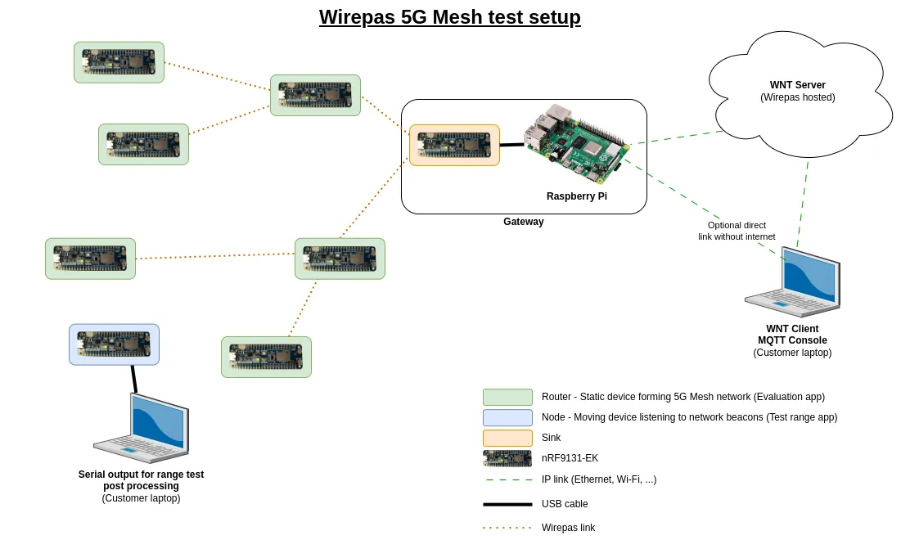
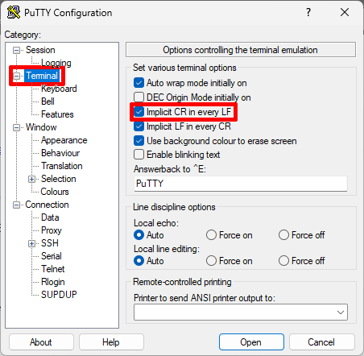
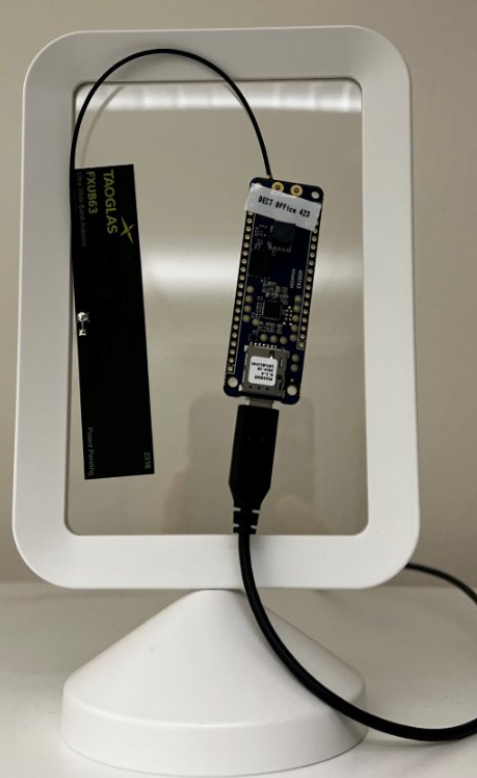

# 5G Mesh range test evaluation kit

## Introduction

This application allows to evaluate the range of Wirepas mesh. It consists of:

- One board configured as Wirepas sink
- Several boards configured as auto-role nodes

Example for a Wirepas 5G Mesh network:



*Note: The range test can be performed even if the sink is not connected to a gateway/WNT instance*


## Test setup

### Using 5G Mesh profile

**Prerequisite**: Working 5G Mesh network as instructed [here](https://developer.wirepas.com/support/solutions/articles/77000560717-your-first-wirepas-5g-mesh-network)

*Note: The Wirepas 5G Mesh range test should not use nRF9161-DK as their RF performances are not optimized for DECT NR+, please use the nRF9131-EK. The nRF9131-EK board name to use during compilation is `pca10165`.*

1. Plug the Taoglas patch antenna (`FXUB63`) to the board
2. Build and flash the range test application on one board, as instructed [here](https://developer.wirepas.com/support/solutions/articles/77000560717-your-first-wirepas-5g-mesh-network#Build-your-App), but replace `app_name=evaluation_app` by `app_name=range_test` when building (make command) and `final_image_evaluation_app.hex` by `final_image_range_test.hex` when flashing the application

### Using 2.4 Ghz Mesh profile

1. Setup a gateway following [those instructions](https://developer.wirepas.com/support/solutions/articles/77000466081-how-to-set-up-a-wirepas-gateway-on-a-raspberry-pi-with-wirepas-prebuilt-image)
2. Compile the evaluation app as instructed [here](https://developer.wirepas.com/support/solutions/articles/77000435375-how-to-install-sdk-and-build-an-application), but replacing `app_name=custom_app` by `app_name=evaluation_app` during the compilation step
3. Flash the application as described [here](https://developer.wirepas.com/support/solutions/articles/77000465762-how-to-flash-wirepas-application) on all boards but one
4. Flash the last board with the range test app. For this you can follow steps 2 and 3 but replacing `evaluation_app` by `range_test`


### Common steps

1. Setup a gateway as instructed [here](https://developer.wirepas.com/support/solutions/articles/77000466081)
2. Connect the sink device to the gateway, or a USB power supply
3. Place nodes flashed with the evaluation app where you want to create the mesh network
4. Connect a phone or laptop to the node flashed with the range test app
5. Open a serial terminal. Parameters are `1000000` bauds, `8N1`, following softwares can be used to monitor and record serial output:

    1. Windows: [Putty](https://www.chiark.greenend.org.uk/~sgtatham/putty/latest.html) or [Tera Term](https://sourceforge.net/projects/tera-term/) can be used
    2. Linux and MacOS: Use cat: `stty -F /dev/ttyACM0 1000000 cs8 -cstopb -parenb && cat /dev/ttyACM0 | tee test_results.txt`. Where `test_results.txt` can be changed to any output file name
    3. Android phone - [Serial Terminal - RS232/485](https://play.google.com/store/apps/details?id=com.hardcodedjoy.serialterminal) app on Play Store

*Note: There are two ports available when you connect the 9131-EK: you can usually choose the first one to be declared, ie the one with the lowest number*

Serial output will look like:

```text
[SCANNER][000002754] I: Neighbor Scan Started in Active mode
[SCANNER][000002946] I: Scan Ended in Active mode
[PRINT_DATA][000002946] I: 	 |	Address   	|	Path loss	|	TX Power	|	Is connected?	|	Is next hop?
[PRINT_DATA][000002946] I:   |  	  3030	|			-76	|			19	|				1	|		1
```

- `Address`: Address of the detected node or sink, in decimal
- `RSSI`: Return Signal Strength Indicator, in dBm
- `TX Power`: Beacon's transmission power, in dBm
- `Is connected?`: `1` if the scanned node is connected to a network, `0` otherwise
- `Is next hop?`: `1` if the node is used as next hop to forward data to the network, `0` otherwise


*Note for Putty: the option `Implicit CR on every LF` must be checked in order to correctly display the logs. It can be found in the `Terminal` category.*



## Test

By default the node will scan for surrounding routers every 15 seconds and display the result on the serial port, it will also send this result to the network with the following parameters:

- Source and destination endpoints: `17`
- Multi-bytes fields are expressed in little endian
- Payload format:

```text
| Counter (uint16_t) | node address 1 (uint32_t) | Path loss 1 (int16_t) | Is connected 1 (uint8_t) | TX Power 1 (uint8_t) | Is next hop? 1 (uint8_t) | ... | node address N | Path loss  N | Is connected N (uint8_t) | TX Power N (uint8_t) | Is next hop? N |
```

Scan interval can be configured thanks to the application configuration data `A6`. Send one byte representing the seconds to wait between two scans, minimum value of 1 seconds. Application configuration documentation is [here](../../libraries/shared_appconfig/shared_appconfig.md), ex: `f67e01a6011E`  for 30 seconds

*Note: It is recommended to aggregate at least 300 recordings at each location as RSSI fluctuates with several parameters, ie 5 minutes with a scan every second*


## Test data post analysis

Once the data are recorded and exported they can be processed thanks to the Python script `parse_range_test.py` in the `tools` folder. It will create a CSV file containing all test data for easy processing and output some statistics, so it is advised to create one file per test location.

The tool takes the file path as parameter `-f` and decimal gateway address as parameter `-g`, see `python tools/parse_range_test.py -h` for full documentation.

```bash
$ python tools/parse_range_test.py -f ~/data/test1.txt  -g 3030
INFO | Parsed 5364 samples:
INFO |  - Average RSSI:         -20.42 dBm
INFO |  - Min:                   -31.0 dBm
INFO |  - Max:                   -19.0 dBm
INFO |  - Standard deviation:     1.05 dBm
INFO | CSV file exported to "/home/user/data/test1.csv"
```

## Antenna orientation

Best results are achieved when the antenna is placed vertically, with the wire going up:

